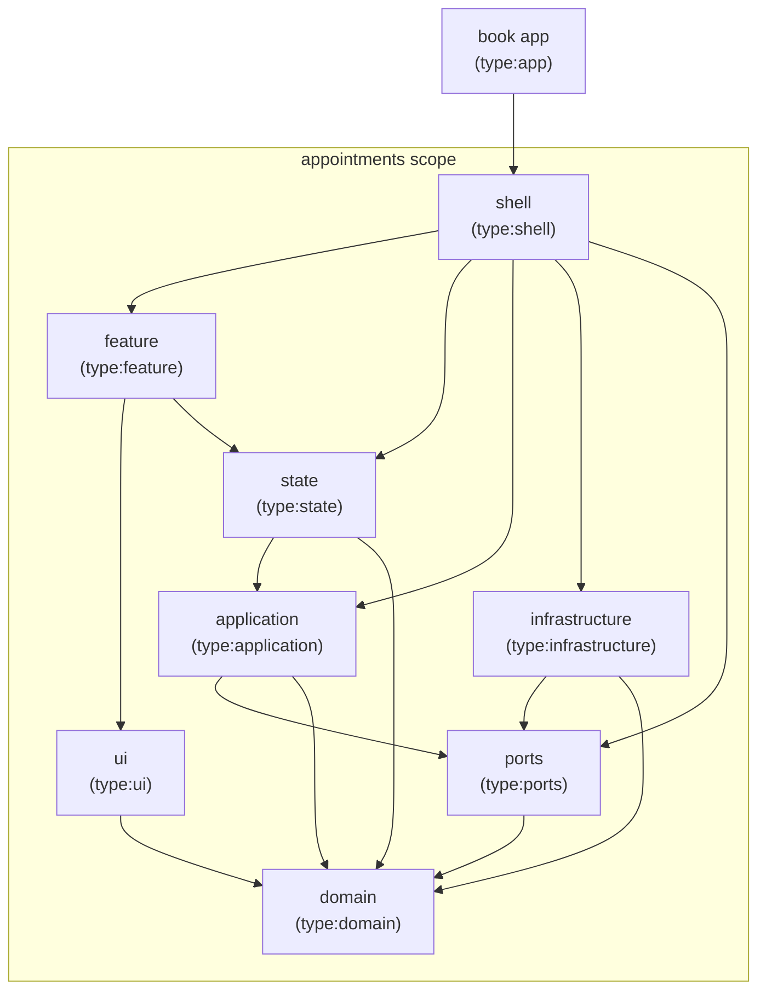
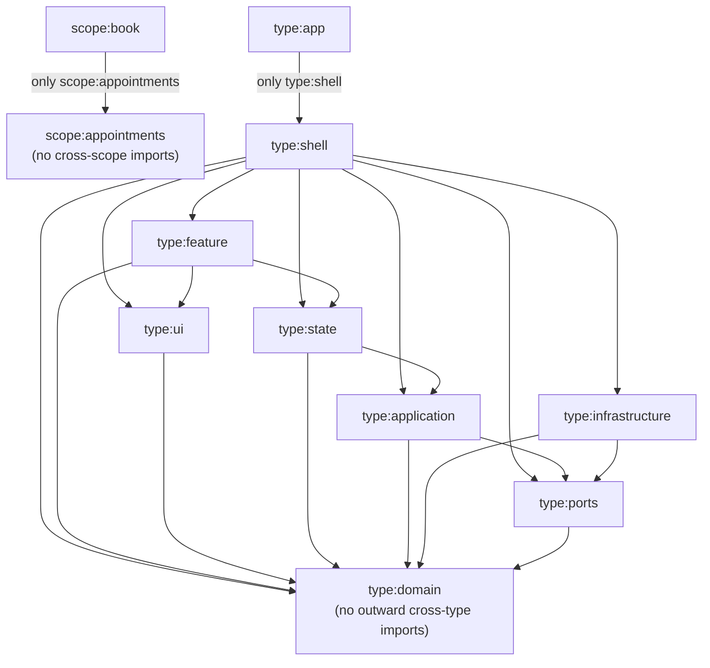
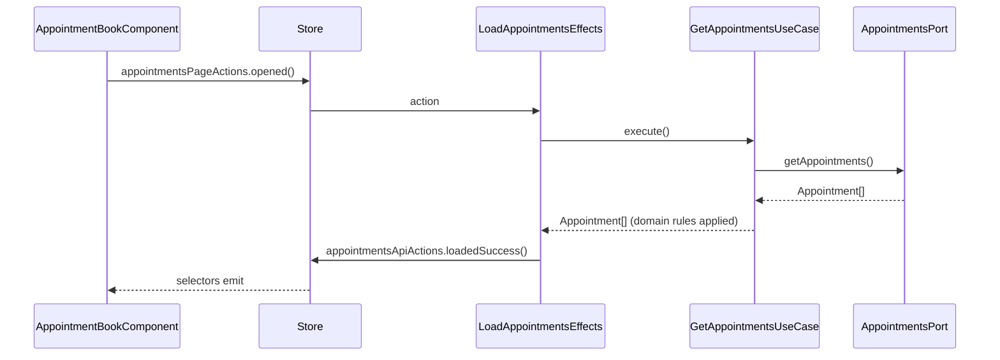

# Hexa

Appointment-booking exercise built with Angular and a local JSON Server API.

## Architecture review

Read [the current architecture review](docs/architecture-review-2026-08-07.md).

## Architecture boundaries

The appointment-booking slice is split into Nx libraries. Arrows show allowed
dependencies between the current projects.



### Nx dependency rules

[`eslint.config.mjs`](eslint.config.mjs) enforces these directions for any
project carrying the corresponding tags. Every arrow means "may depend on";
all other cross-project directions are rejected by
`@nx/enforce-module-boundaries`.



## State management

NgRx holds the page state in `libs/appointments/state`. It is an outer layer:
the store knows the use cases, the use cases know nothing about the store.

- **Actions** are named after their source, not after the reducer:
  `appointmentsPageActions` for user intents, `appointmentsApiActions` for results.
- **The reducer** stores `Appointment` values from the domain plus a `status`
  and an `errorMessage`, so loading, empty, and failed states are distinguishable.
- **Effects** call `GetAppointmentsUseCase` and translate its result into actions.
  They never reach a port, an HTTP client, or a domain rule directly.
- **Selectors** derive what the template needs; components only dispatch and select.



`provideAppointmentsState()` registers the feature slice and its effects, and is
called from `provideAppointmentsShell()`. That provider is applied on the
appointments route in
[`libs/appointments/shell`](libs/appointments/shell/src/lib/appointments.routes.ts),
so the port bindings and the state slice live in the route's environment
injector rather than the application root. The root store and the devtools live
in [`apps/book/src/app.config.ts`](apps/book/src/app.config.ts).

## Trusting the API payload

`HttpAppointmentsAdapter` is the only place that knows what the API returns. The
API describes an appointment's start as a `date` and a `startTime`; the domain
wants the single instant those two name. Translating between them is the reason
the seam exists, and `AppointmentDto` never leaves the file.

Typing the response — `http.get<AppointmentDto[]>` — would be a claim rather
than a check. The type argument is erased, nothing inspects the body, and a
vendor that breaks its contract breaks a layer that did nothing wrong: a `null`
customer name used to throw inside a domain rule, and an unparsable date became
an `Invalid Date` that the same rule then dropped without a word. The adapter
asks for `unknown` and earns the type instead, so that everything past this file
may trust what it receives.

A [zod/mini](https://zod.dev) schema is that contract in executable form.
`z.infer` derives `AppointmentDto` from it, so the shape and the checks are one
declaration and cannot drift apart.

**Structure is checked here; meaning stays in the domain.** An empty customer
name is a valid string and passes the schema. That an appointment without a name
is not worth showing is a decision about appointments, so
[`filterAppointmentsWithCustomerName`](libs/appointments/domain/src/lib/appointment.rules.ts)
still makes it. A test pins that boundary, because `.min(1)` is one word away and
would quietly move a business rule into infrastructure.

One check resists the schema. `2026-13-45` matches the date pattern — the digits
are in the right places — and `new Date` rolls it over to February 2027 rather
than refusing. The only way to know a string named the instant it claimed is to
build the date and read the parts back.

`zod/mini` rather than the chained API, decided by measurement rather than taste:
both build from identical source — only the import differs — and the chained one
costs several times more transferred bytes, because its validators hang off the
schema instance where a bundler cannot drop the ones you never call. Neither
touches the initial bundle, so validation is paid for only by whoever opens the
route. `npx nx build book` prints the numbers if you want to check the claim.

## Choosing a data source

`appointmentsRoutes` takes an `AppointmentsConfig` and hands it to the shell,
which decides which adapter every port gets:

```ts
{ dataSource: 'api' | 'memory', apiBaseUrl: string }
```

The value comes from
[`apps/book/src/environments/environment.ts`](apps/book/src/environments/environment.ts),
and the `memory` build configuration swaps in `environment.memory.ts` through
`fileReplacements`. Nothing reads a token or a global: the choice travels as an
argument through the lazy route's dynamic import, which is also why a static
import of the shell from `app.config.ts` is rejected by lint — it would pull the
whole feature into the initial bundle.

`serve-memory` is its own target rather than a `serve` configuration, because
Nx `dependsOn` is per-target: a configuration would still have started
json-server, which defeats the point.

## Getting started

Install dependencies:

```sh
npm install
```

Run the Angular application against the API:

```sh
npx nx serve book
```

Or run it with no backend at all, on the in-memory adapter's seed data:

```sh
npx nx serve-memory book
```

## Appointment API

Start the API at `http://localhost:3000`:

```sh
npm run api
```

The API supports:

- `GET /appointments`
- `GET /appointments?date=YYYY-MM-DD`
- `POST /appointments`

### Bruno collection

Import the [Appointment Booking API collection](bruno/appointment-booking-api) in Bruno, select the `Local` environment, and run the requests. The create request persists a demo appointment.

Successful writes are persisted in `server/db.json`. To restore the two demo
appointments, stop the API and run:

```sh
git restore server/db.json
```

## Checks

```sh
npm test
npx nx run-many -t lint
npx nx build book
npx nx e2e book-e2e
```

`npm test` runs every project's `test` target. The `ui` library goes through
`@nx/angular:unit-test` because its component specs need the Angular AOT compiler
for signal inputs; every other library runs on plain Vitest.
Both are covered by that one command.

`npx nx run-many -t lint` is not only a style check. `@nx/enforce-module-boundaries`
rejects a wrong-way project dependency *and*, through `bannedExternalImports`, an
`@angular/*` or `@ngrx/*` import into `domain`, `ports` or `application`. Adding
one deliberately turns lint red.

`npx nx e2e book-e2e` is Playwright, and it is currently one smoke test. It runs
against `serve-memory`, so it starts its own dev server on the in-memory adapter
and needs no json-server. Chromium only: nothing here is browser-specific yet.
Artifacts land in `dist/.playwright`, which is already ignored.

For a coverage report across `libs/`:

```sh
npm run test:coverage
```

## Deliberate trade-offs

These are decisions, not oversights. Each has a stated trigger for revisiting.

**Ports return `Observable`.** `AppointmentsPort` is typed
`Observable<Appointment[]>`, so `rxjs` sits in the ports and application
libraries alongside the domain. This is pragmatic in an Angular app and costs
nothing today. It stops being free if the core is ever consumed outside RxJS —
a Node CLI, a worker — or if a port's stream semantics (does it complete? does
it re-emit?) become part of the contract without being written down here.
Revisit at the first non-Angular consumer.

**Past appointments are filtered on the client.** The API supports
`GET /appointments?date=YYYY-MM-DD`, but `HttpAppointmentsAdapter` fetches
everything and `filterCurrentAndFutureAppointments` discards the past in the
domain. That keeps the rule in the core where it is testable without a server,
which is the right call for a demo dataset and the wrong one at a few thousand
rows. The trigger is the first slow page load; the fix is a port method that
takes a criterion, not moving the rule into the query.

**One bad record fails the whole batch.** A malformed appointment aborts the
request and the page shows an error, instead of being skipped so that the rest
can render. Dropping it quietly would be the silent data loss this boundary
exists to prevent, and a demo dataset has no rows to spare. That reverses on a
large feed from a vendor who is routinely a little wrong: there, one bad row
hiding forty good ones is the worse failure. The trigger is the first support
question about a missing appointment; the fix is to collect the faults and
report them alongside the results, not to ignore them.

**One feature, eight libraries.** Two ports, two DI tokens, an effect, a reducer
and three selectors around two lines of business rule. On a product this ratio
would be the finding; here the structure is the deliverable. The honest test is
the *second* feature: if booking an appointment reuses `domain`, `ports` and
`application` as they stand, the granularity paid off. If it needs a new library
at every layer to add one form, `ports` should merge into `application`.
