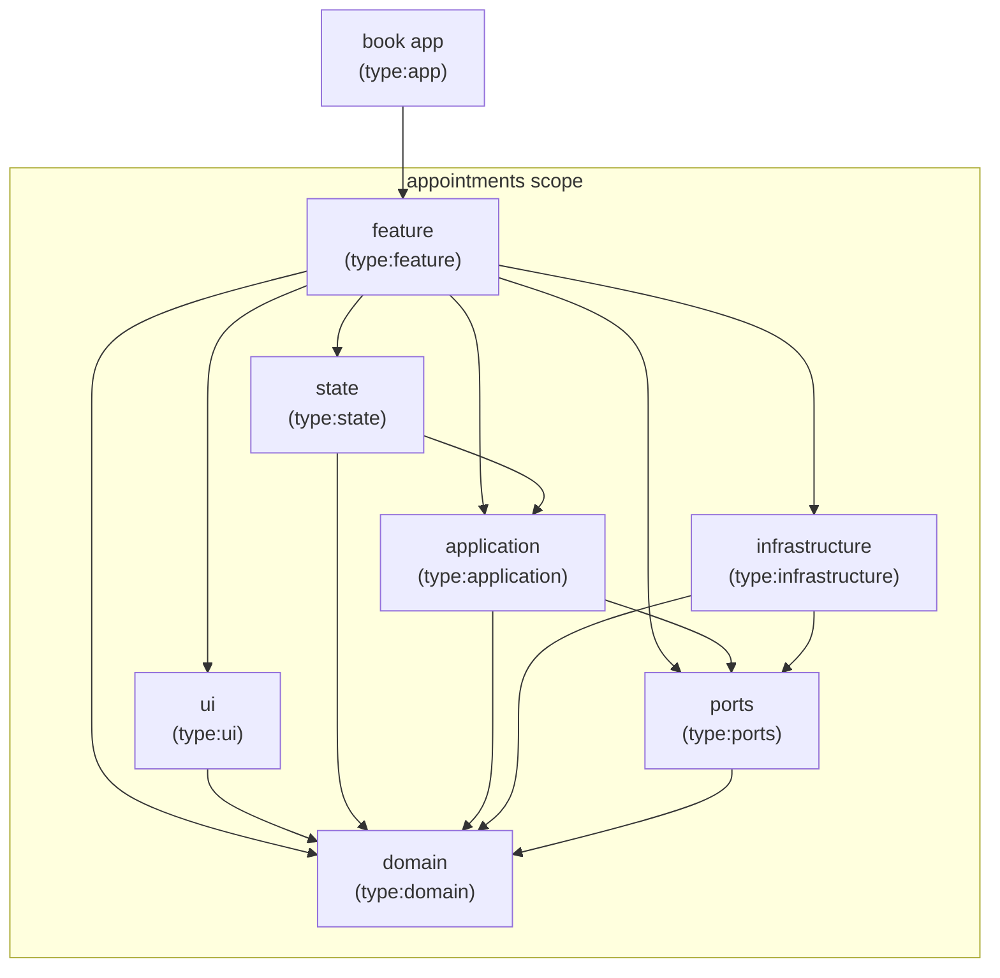
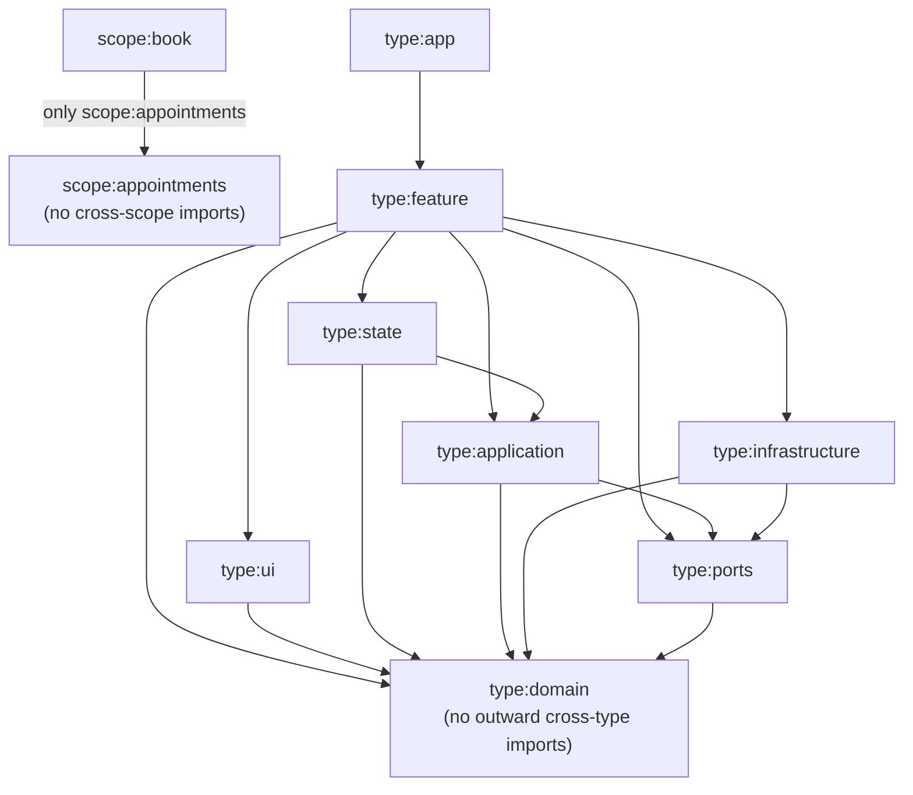
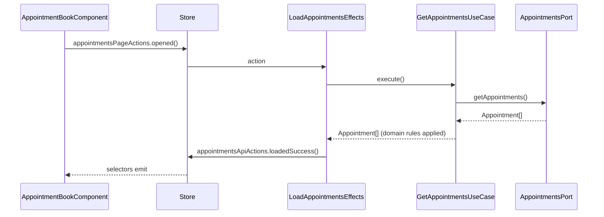

# Hexa

Appointment-booking exercise built with Angular and a local JSON Server API.

## Architecture review

Open [the current architecture review](docs/architecture-review.html) in a browser.

## Architecture boundaries

The appointment-booking slice is split into Nx libraries. Arrows show allowed
dependencies between the current projects.



### Nx dependency rules

[`eslint.config.mjs`](eslint.config.mjs) enforces these directions for any
project carrying the corresponding tags. Every arrow means "may depend on";
all other cross-project directions are rejected by
`@nx/enforce-module-boundaries`.



## State management

NgRx holds the page state in `libs/appointments/state`. It is an outer layer:
the store knows the use cases, the use cases know nothing about the store.

- **Actions** are named after their source, not after the reducer:
  `appointmentsPageActions` for user intents, `appointmentsApiActions` for results.
- **The reducer** stores `Appointment` values from the domain plus a `status`
  and an `errorMessage`, so loading, empty, and failed states are distinguishable.
- **Effects** call `GetAppointmentsUseCase` and translate its result into actions.
  They never reach a port, an HTTP client, or a domain rule directly.
- **Selectors** derive what the template needs; components only dispatch and select.



`provideAppointmentsState()` registers the feature slice and its effects, and is
called from `provideAppointmentsFeature()`. The root store and the devtools live
in [`apps/book/src/app.config.ts`](apps/book/src/app.config.ts).

## Getting started

Install dependencies:

```sh
npm install
```

Run the Angular application:

```sh
npx nx serve book
```

## Appointment API

Start the API at `http://localhost:3000`:

```sh
npm run api
```

The API supports:

- `GET /appointments`
- `GET /appointments?date=YYYY-MM-DD`
- `POST /appointments`

### Bruno collection

Import the [Appointment Booking API collection](/Users/gilferra/Sandbox/hexa/bruno/appointment-booking-api) in Bruno, select the `Local` environment, and run the requests. The create request persists a demo appointment.

Successful writes are persisted in `server/db.json`. To restore the two demo
appointments, stop the API and run:

```sh
git restore server/db.json
```

## Checks

```sh
npx nx test book
npx nx lint book
npx nx build book
```
